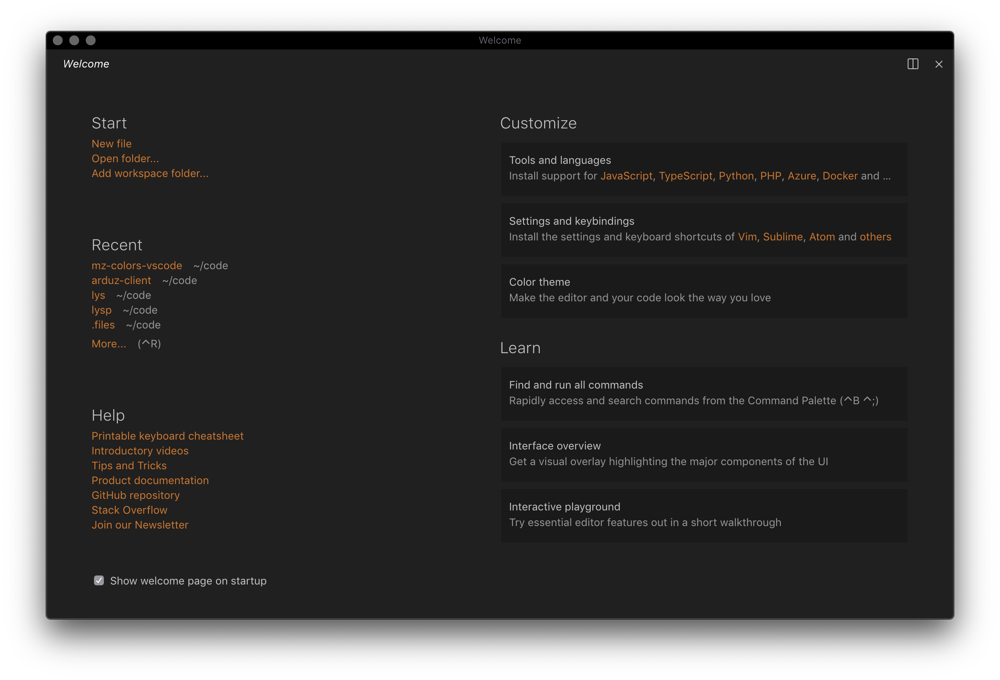
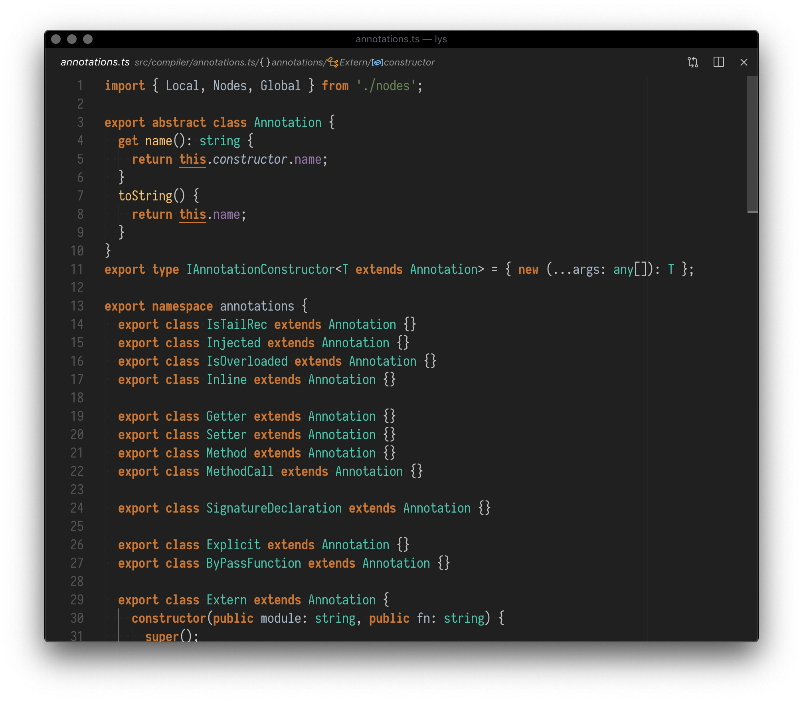
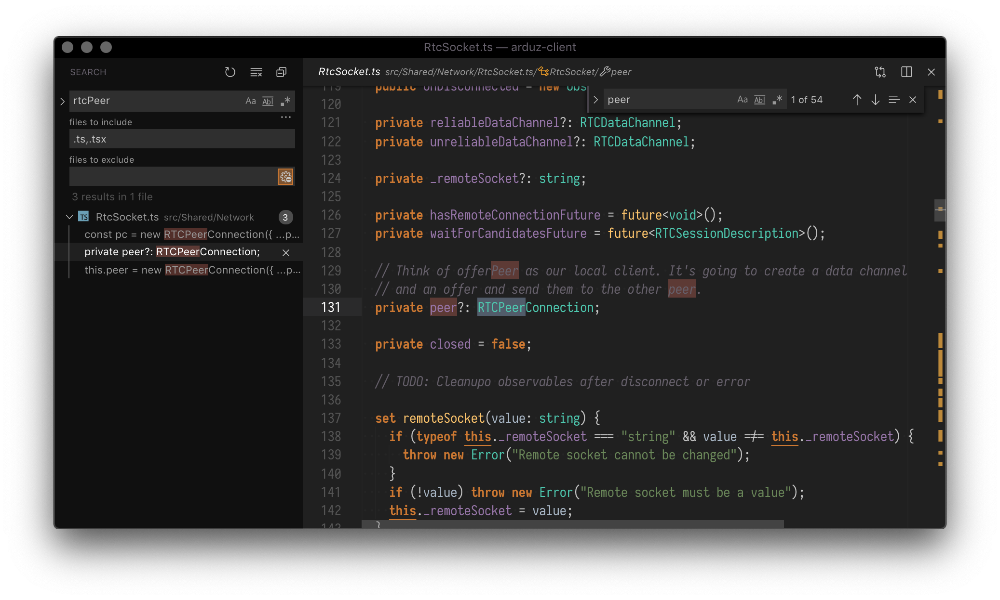
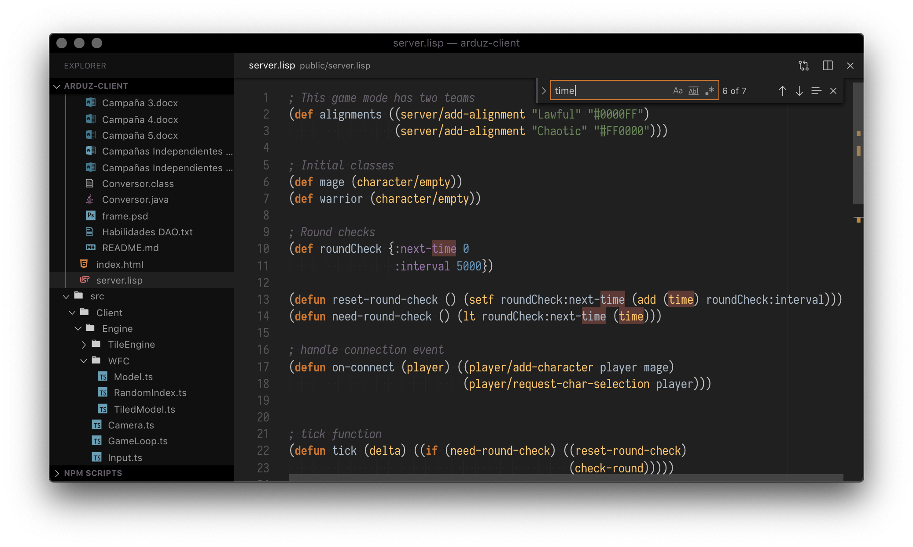

[VSCode Marketplace](https://marketplace.visualstudio.com/items?itemName=menduz.mz-colors)

# mz-colors, a simple theme

This theme focuses in contrasts and highlights. It was designed following this principle:

> It is a failure in design if you need to add a border to separate things.

So it is a best effort using highlights and background colors to set up context.







## Recommended setup

- Do not use the activity bar, the keyboard shortcuts are easy to remember.
- When possible, turn off the status bar, vertical space is precious.
- Disable tabs
- Disable "Open editors"

```json
{
  "editor.wordWrapColumn": 120,
  "editor.rulers": [120, 80],
  "workbench.editor.showIcons": true,
  "workbench.statusBar.feedback.visible": false,
  "workbench.editor.tabCloseButton": "off",
  "workbench.editor.enablePreview": true,
  "zenMode.hideActivityBar": true,
  "zenMode.fullScreen": true,
  "workbench.iconTheme": "file-icons",
  "debug.toolBarLocation": "docked",
  "editor.lineNumbers": "relative",
  "editor.dragAndDrop": false,
  "editor.cursorBlinking": "solid",
  "editor.detectIndentation": false,
  "editor.tabSize": 2,
  "editor.folding": false,
  "editor.renderWhitespace": "boundary",
  "editor.roundedSelection": false,
  "editor.autoClosingBrackets": "never",
  "editor.fontLigatures": false,
  "editor.glyphMargin": true,
  "editor.renderIndentGuides": true,
  "editor.renderLineHighlight": "all",
  "editor.letterSpacing": 0,
  "editor.insertSpaces": true,
  "editor.smoothScrolling": false,
  "editor.accessibilitySupport": "off",
  "editor.snippetSuggestions": "bottom",
  "editor.scrollBeyondLastLine": true,
  "breadcrumbs.enabled": true,
  "explorer.openEditors.visible": 0,
  "prettier.tabWidth": 2,
  "workbench.statusBar.visible": true,
  "editor.cursorStyle": "block",
  "workbench.activityBar.visible": false,
  "explorer.decorations.badges": false
}
```
